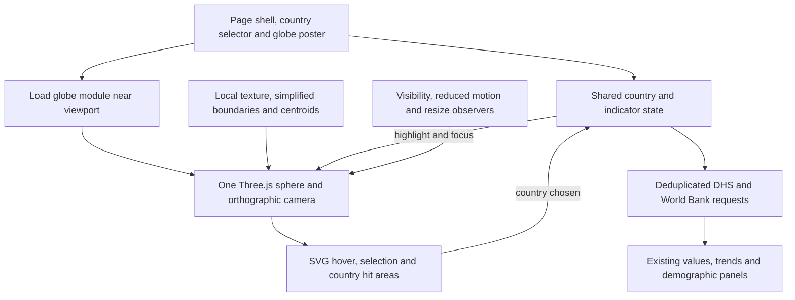

**NPH globe replacement: reference audit and implementation plan**

Prepared 13 September 2026. Core renderer replacement implemented locally: single direct Three.js globe, shared country state, static country options, request cancellation, and production bundle cleanup. Indicator-colored map themes remain a separate data-product milestone.

Yes, the Atlas approach can replace the current globe while keeping React, the existing health indicators, data panels, and GitHub Pages deployment. The recommended implementation is a small custom Three.js globe with an orthographic camera, a locally served map texture, and projected SVG country outlines and interaction areas. Its advantages must be demonstrated with a prototype and comparable measurements.

**What was inspected and what remains unverified**

- Current application source, dependency configuration, deployment scripts, and existing `dist` files in this repository.
- The downloaded reference at `D:\Isaiah\Webisitess\sgdatlas`, including compiled globe code, homepage integration, styles, and asset references.
- The official [2023 Atlas archive](https://datatopics.worldbank.org/sdgatlas/archive/2023/) and its linked [public source repository](https://github.com/sdga2023/code).
- The originally supplied URL currently redirects to the [2026 Atlas](https://data360.worldbank.org/en/atlas/). The 2023 archive matches the downloaded reference.
- Interactive browser inspection could not start because the browser tool failed during connection. Interactions below are verified from source, not from an executed click-through. Frame rate, live transfer sizes, and device load times have not been measured.
- The existing NPH `dist` is dated April 28 and predates current source edits. Its measurements are evidence of that build, not a fresh production baseline.
- Existing edits to `Home.tsx`, `images.ts`, `data.d.ts`, and `vite.config.ts` must be preserved during implementation.

**How the Atlas globe works**

The reference combines Three.js/WebGL rendering with D3 geographic projection and SVG overlays. The compiled implementation is in the mirror's [_app/immutable/chunks/triggerAnalytics.0ad5ce5c.js](<D:/Isaiah/Webisitess/sgdatlas/datatopics.worldbank.org/sdgatlas/_app/immutable/chunks/triggerAnalytics.0ad5ce5c.js:3108>); the filename obscures that it also contains rendering code.

| Layer | Reference implementation | Why it matters for NPH |
| --- | --- | --- |
| Globe surface | A 32-by-32-segment sphere with a prepainted map texture | Avoids creating elevated meshes for every country just to display country colors. |
| Camera | Orthographic | Produces the Atlas's round, illustrative appearance. |
| Shading | Toon materials, lights, a small bump effect, and a tone gradient | Gives depth without photographic terrain. |
| Theme transitions | Two spheres crossfade between goal textures | Can support future indicator previews without rebuilding country geometry. |
| Selection | D3 orthographic projection follows the camera; SVG draws country outlines | Keeps geographic interaction separate from the textured sphere. |
| Motion | OrbitControls drag, damping, slow rotation; animated focus toward centroids | These interactions can be implemented inside a React component. |
| Visibility | IntersectionObserver stops animation outside the viewport | Avoids spending frames on an offscreen visualization. |

The homepage uses a country search selector and disables country polygon clicks and hover. Story-page globes enable those interactions. Goal-row hover/focus changes the active texture; clicking the row navigates to a story. The country reference is shared in application state; refresh persistence was not established by this audit. These distinctions are visible in the mirror's [homepage module](<D:/Isaiah/Webisitess/sgdatlas/datatopics.worldbank.org/sdgatlas/_app/immutable/entry/_page.svelte.85ef9f0d.js:1>) and [globe styles](<D:/Isaiah/Webisitess/sgdatlas/datatopics.worldbank.org/sdgatlas/_app/immutable/assets/triggerAnalytics.d86ce451.css:1>).

The reference is not automatically a small download. Its mirrored homepage declares 29 JavaScript preloads totaling about 1.17 MB raw, before textures. It also uses uncapped device pixel ratio and maximum texture anisotropy. We should borrow the rendering design and improve those resource settings.

**How the two projects deploy**

| Concern | Atlas source | Current NPH application / proposed replacement |
| --- | --- | --- |
| Framework | SvelteKit with Vite | React 18, TypeScript, Vite |
| Output | Static adapter; HTML and hashed assets | Vite-generated `dist` |
| Base path | Production `/sdgatlas` | `/` for `nph-solutions.com` |
| Build | `npm run build` calls `production.sh` | `npm run build` runs sitemap generation, TypeScript, and Vite |
| Routing support | Static fallback `404.html`; script creates goal URL aliases | Existing `public/404.html` redirect and `index.html` URL restoration |
| Publish step | Public build script prepares static output; actual World Bank infrastructure/publishing pipeline was not established | `npm run deploy` builds and publishes `dist` with `gh-pages` |
| Globe backend | Published textures and geographic data are sufficient for rendering | Same-origin static globe assets; existing DHS/World Bank API calls remain separate |

Atlas evidence: [package.json](https://github.com/sdga2023/code/blob/main/package.json), [svelte.config.js](https://github.com/sdga2023/code/blob/main/svelte.config.js), and [production.sh](https://github.com/sdga2023/code/blob/main/production.sh). The script prepares `.nojekyll` and static route aliases; it does not establish which production server or CDN hosts the site.

NPH evidence: [package.json](../package.json), [vite.config.ts](../vite.config.ts), [CNAME](../public/CNAME), [404.html](../public/404.html), and [index.html](../index.html). No framework migration, globe API service, or hosting migration is needed. Vite's `server.headers` configuration affects the development server; production caching must be checked on the deployed host.

The downloaded Atlas folder is an HTTrack mirror, with missing dynamically loaded textures and some saved error pages. It is unsuitable as a source tree or deployment package. If any reference assets or code are reused, record their applicable terms and attribution: the public repository's `LICENSE.md` describes a third-party spinner and is not evidence that the entire globe implementation is MIT-licensed. The preferred path is an NPH implementation of the observed mechanics using existing licensed dependencies and explicitly sourced geographic assets.

**Why the current globe feels heavy**

| Finding | Evidence | Planned action |
| --- | --- | --- |
| Two globe instances mount at each settled screen width; one is only hidden by CSS | `Home.tsx:1053`, `1062`, `1135`, `1155`, `1175`, `1195` | One component and renderer, arranged with responsive CSS. |
| Deliberate minimum one-second wait | `OptimizedGlobeVisualization.tsx:103`, `144` | Remove the artificial delay; show an immediate poster and usable selector. |
| The existing built entry preloads the heavy globe chunk | `dist/index.html:155`; entry, charts, and UI import shared helpers from that chunk | Remove the obsolete manual chunk grouping and inspect the newly built dependency graph. |
| All country polygons become runtime meshes, including mostly transparent ones | Globe component `:166`, `196` | A textured sphere plus simplified interaction geometry. |
| Angular curvature resolution is set to 2 degrees | Globe component `:196`; installed `three-globe/README.md:157` | Smaller angular values increase detail; do not carry over the misleading optimization assumption. |
| External earth texture plus unused night/topology prefetches | Globe component `:108`, `117`, `125`, `164` | Local, versioned texture assets; request only what is used. |
| Cleanup removes DOM but does not explicitly stop/dispose the renderer | Globe component `:389` | Cancel frames and pending work; dispose controls, textures, geometry, materials, and renderer. |
| Country-list request occurs in Home and both mounted selectors | `Home.tsx:421`; `MobileCountrySelector.tsx:29` | Share one static-first country catalogue and optional deduplicated refresh. |
| Country selection starts demographics twice; fast changes can leave stale responses | `Home.tsx:411`, `715` | One request owner, keyed caching, cancellation or request-generation checks. |

Read the relevant implementation in [Home.tsx](../src/pages/Home.tsx) and [OptimizedGlobeVisualization.tsx](../src/components/globe/OptimizedGlobeVisualization.tsx).

The April build contains:

| Artifact | Raw bytes | Locally computed gzip bytes |
| --- | ---: | ---: |
| Globe vendor chunk | 1,711,277 | 479,913 |
| Globe component, including geographic data | 359,425 | 125,037 |
| Combined, excluding textures | 2,070,702 | 604,950 |

The gzip figures are compression measurements of local files, not observed HTTP transfers. A shared CommonJS helper is exported from the globe vendor chunk and imported by the entry/UI/chart chunks, which defeats the intended loading boundary in that artifact. A source-level `React.lazy` alone does not prove the engine is deferred. A fresh build is needed to confirm whether current edits still produce this graph.

**One-to-one functionality mapping**

| Function | Atlas behavior | NPH today | Proposed NPH behavior |
| --- | --- | --- | --- |
| Overall appearance | Shaded illustrative sphere with thematic texture | Satellite texture with elevated country polygons | Atlas sphere/shading with NPH palette; flat country highlights replace extrusion. This is an intentional visual change. |
| Initial view | Rotating overview | Rotating overview; panel has Uganda as default country | Preserve an overview; make the Uganda panel default explicit when an indicator is opened. |
| Automatic rotation | Slow rotation, stops on country reference | Slow rotation, stops on selection | Preserve; add pause/resume control, reduced-motion support, hidden-tab and offscreen suspension. |
| Drag | Damped globe rotation | Globe-library controls | Preserve mouse/touch drag; distinguish drag from click. |
| Zoom and pan | Both disabled | Installed globe.gl uses OrbitControls, leaves zoom enabled and explicitly disables pan | Preserve bounded wheel/pinch zoom with matching SVG scale; keep pan disabled. Zoom is retained NPH functionality beyond the Atlas reference. Verify actual gestures during baseline testing. |
| Country search | Shared searchable reference-country selector | Searchable, clearable DHS selector | Preserve; make it work before renderer/data APIs are ready. |
| Country hover | Disabled on homepage; available in stories | Orange raised polygon | Retain orange fill/outline on usable countries; consistent pointer cursor. |
| Country click | Disabled on homepage; available in stories | Mapped polygon selects DHS country | Retain direct click/tap selection, including back-hemisphere clipping and drag suppression. |
| Selected country | Contrasting SVG outline | Red elevated polygon | Red translucent fill plus contrasting outline; selection remains visible while rotating/resizing. |
| Focus selection | About one-second movement to centroid | About one-second movement to centroid | Preserve; apply pending selection after renderer readiness; immediate movement under reduced motion. |
| Clear selection | Clears shared reference | Clears globe but can leave old panel country | Unify clear behavior: reset globe and panel country, retain indicator choice, show a country-selection prompt. This corrects existing inconsistent state. |
| Indicator/story rows | Seventeen goal links preview different globe textures | Eighteen health-indicator rows open a panel | Preserve all eighteen definitions and existing panel actions. Keyboard focus and click remain distinct from preview. |
| Data-colored globe | Precomputed goal textures | Satellite surface does not encode the selected indicator | Separate enhancement requiring comparable per-country data, dates, units, legend and missing-data policy; not required for engine replacement. |
| Latest data and trends | Separate story visualizations | Fixed right-side details drawer with latest-value/trend tabs and next/previous indicators | Preserve the drawer, its close behavior and content; lazy-load chart code when needed. |
| Demographics | Atlas story content | Population, education, residence and other cards | Preserve cards and per-field loading; fetch independently of globe readiness. |
| Country chosen in details panel | Shared Atlas reference model | Panel selection can differ from globe selection | Route every country selection through one owner so panel, selector, and highlight agree. |
| Mobile | Globe and selector flow into stacked layout | Separate desktop/mobile component trees | Single component, responsive layout, no hidden renderer; accessible selector fallback. |
| Navigation | Goal rows navigate to stories | Indicators open current details; explorer is separate | Keep current NPH navigation semantics. |
| Failure | Texture fallback and loading state | Some failures can leave a spinner indefinitely | Poster, usable selector, clear retry action, and data panel independent of WebGL. |

Canonical country identity must be explicit: the current callback's `value` is a DHS code; globe geometry uses ISO3; World Bank requests need their own verified code mapping. DHS codes are not interchangeable with ISO2. Of 92 mapping entries, 21 currently have null ISO3, including countries whose geometry does exist. Audit all joins, including India, Guatemala, Madagascar, Eswatini, island states, and special entries such as Nigeria (Ondo State).

Current control defaults were checked in installed `globe.gl/dist/globe.gl.mjs:502`, `:539` and `three/examples/jsm/controls/OrbitControls.js:227`. These are source findings; browser gesture testing is still pending.

**Proposed architecture and screen layout**



The globe and data requests are independent consumers of shared state. A slow API must not prevent the globe from appearing or the country picker from working. A failed renderer must not prevent the data panel from working.

Desktop schematic — proposed arrangement, not a screenshot:

```text
NPH introduction / headline
┌──────────────────────────────────┬──────────────────────────────┐
│ Country [Uganda             ×]    │ HEALTH INDICATORS            │
│                                  │ 01  Total fertility rate     │
│      Atlas-style shaded globe    │ 02  Neonatal mortality       │
│      selected country outlined   │ 03  Postneonatal mortality   │
│                                  │ ...all 18 existing indicators│
│      [Pause rotation] [Reset]     │                              │
└──────────────────────────────────┴──────────────────────────────┘

Selecting an indicator opens the existing fixed right-side drawer:
                                     ┌────────────────────────────┐
                                     │ Country + indicator    [×] │
                                     │ [Latest value] [Trend]     │
                                     │ Values, sources and years │
                                     │ Demographics              │
                                     │ [Previous] [Next]          │
                                     └────────────────────────────┘
```

Mobile order: country selector → responsive globe → indicator list. Selecting an indicator opens the existing responsive details drawer over the page. CSS can retain the current curved desktop list treatment where space permits; layout changes must not create another globe instance. The poster reserves the final globe dimensions to avoid a layout jump. Moving details below the globe would be a separate optional layout change, outside the recommended engine replacement.

**Implementation sequence and reviewable outcomes**

1. **Establish the baseline and interaction contract.** Preserve current edits, produce an isolated production build, and record five cold-cache runs plus warm-cache revisits at desktop and mobile widths. Use the same browser, viewport, network and CPU settings for comparisons. Measure globe first-visible/interactive times separately from page LCP and API completion. Confirm wheel/pinch controls and document initial selection/clear semantics. Deliverable: baseline table and completed behavior checklist.

2. **Prepare assets and country identity.** Create a verified country catalogue joining DHS, ISO3 and World Bank identifiers. Generate simplified shared boundaries and centroids from approved geographic data, retaining small-country coverage and topology. Generate an NPH base texture and static poster with documented provenance. Begin with roughly 1024-by-512 texture resolution; compare 2048-by-1024 only if visual QA justifies it. Choose a suitable image format after checking coastlines and text-free map details. Deliverable: versioned assets, measured sizes and a mapping audit.

3. **Build the isolated renderer.** Add a React `AtlasGlobe` with a small sphere, orthographic camera, NPH shading and SVG overlay. Use one sphere for the base implementation; allocate a second only for an actual texture transition. Keep animation state in refs rather than rerendering React on every frame. Project SVG paths with the same camera orientation, scale and viewport; clip the back hemisphere. Preserve the existing callback payload through an adapter. Deliverable: reviewable local globe with drag, click, hover, search focus, clear and responsive sizing.

4. **Integrate the existing functionality.** Replace the repeated Home globe trees with one mounted component. Centralize selection so the globe selector, geometry click and panel selector update together. Keep all eighteen indicators, charts and demographic cards. Share country options, deduplicate requests, and ignore aborted/stale results. Reapply selection if it arrives before globe readiness. Deliverable: end-to-end NPH experience with the new renderer and the mapping table verified.

5. **Set loading and animation limits.** Remove the artificial delay and unused remote preloads. Lazy-load the renderer near the viewport; above-the-fold use should start promptly after the shell paints rather than wait for an arbitrary timer. Cap pixel ratio (initial candidate 1.5, increase only if justified). Suspend frames outside the viewport, in hidden tabs and when motion is disabled; render on change when stationary. Handle WebGL context loss and dispose all resources on unmount. Remove `globe.gl` and its unused transitive wrapper stack after usage checks, declare a compatible direct Three.js dependency, and verify there is one Three.js version. Remove the old manual globe chunk and inspect fresh entry imports. Deliverable: bundle report, request waterfall and renderer lifecycle evidence.

6. **Verify and prepare deployment.** Run TypeScript, production build and existing lint checks, separating pre-existing failures from new ones. Use targeted interaction tests for country identity, selection race conditions and resource cleanup. Compare visuals on desktop/tablet/mobile and test a real mobile device where available. Prepare the usual `dist`, retaining CNAME and SPA redirects. Test direct links and asset URLs in production preview. Keep a simple implementation switch during review, with only the chosen renderer imported/mounted; the previous tested commit provides rollback. Publishing is a later implementation step, not part of this planning task.

Optional following milestone: reproduce the Atlas's indicator-driven map themes. Define one comparable statistic per indicator, which survey population it represents, year/recency policy, units, color scale, legend and missing-data style. Use reproducible, dated data snapshots and load only the requested theme, with bounded caching. Do not color a world map from a single selected-country response or treat missing values as zero. Rapid hover previews must not start eighteen API requests or overwrite the committed indicator selection.

**Expected file changes when implementation is authorized**

| File or proposed area | Work |
| --- | --- |
| `src/components/globe/AtlasGlobe.tsx` | React lifecycle and public component contract. |
| `src/components/globe/createGlobeScene.ts` | Camera, sphere, controls, renderer, animation and disposal. |
| `src/components/globe/CountryOverlay.tsx` | Projected outlines, hit areas, hover, clipping and pointer handling. |
| `src/components/globe/globeTypes.ts` | Explicit canonical country and event types. |
| `src/components/globe/MobileCountrySelector.tsx` | Shared country options and common selection owner; consider a neutral name. |
| `src/pages/Home.tsx`, `Home.css` | One responsive globe and consistent panel/globe state. |
| `src/data/country-mapping.json`, country catalogue | Correct identity joins and fallback metadata. |
| `src/hooks/useCountryData.ts` or equivalent small shared module | Cache keys, deduplication, abort/generation handling and loading state. |
| `scripts/generate-globe-assets.*` | Reproducible geographic simplification and texture/poster generation. |
| `public/globe/` or imported hashed assets | Local versioned texture, boundaries, centroids and poster. |
| `vite.config.ts`, package files | Remove obsolete grouping and wrapper dependency; validate real lazy loading. |
| Targeted browser/unit checks | Interaction contract, country joins, async races, readiness and cleanup. |

The existing large Home component can be incrementally extracted around the globe and country-data boundaries. A general homepage rewrite is unnecessary for this replacement.

**Acceptance criteria and performance targets**

The numeric budgets below are proposed prototype targets, not achieved results or promises.

| Check | Acceptance target |
| --- | --- |
| Mounted renderer | Exactly one at mobile, tablet and desktop widths, including after resizing. |
| Readiness | Poster and country selector usable without waiting for Three.js or live data APIs. |
| JavaScript loading | No `globe.gl` wrapper stack; one direct Three.js version; no accidental static entry dependency on the renderer. |
| Transfer budget | Aim for no more than 250 KB gzip globe runtime JS and 100 KB gzip geographic metadata; initial texture/poster aim below 250 KB combined. Validate with the prototype and compare total bytes including images. |
| Improvement | Target at least 40% lower globe-related cold transfer and interactive-ready time against a fresh baseline under identical conditions. If unmet, use profiling to decide whether to simplify further before replacement. |
| Animation | Target at least 30 FPS on the agreed mid-range mobile device during interaction; no ongoing animation frames while hidden/offscreen or stationary with rotation disabled. |
| Data requests | One owner for country options; no duplicate in-flight request for the same country/indicator; no stale country's data in the new selection. |
| State parity | Search, click and panel selector agree; selected state survives resize and late initialization; clear is coherent. |
| Accessibility | Keyboard-accessible selector, meaningful controls, visible focus, reduced motion and non-WebGL access to data. |
| Error recovery | Blocked texture/geometry/API requests and WebGL failure leave a usable selector and understandable panel state. |
| Lifecycle | Repeated navigation and breakpoint changes do not accumulate canvases, frame loops or GPU resources. |
| Visual checks | Front/back clipping, coastline alignment, small islands, touch drag versus tap, no mobile scroll trap, and no layout jump. |
| Deployment | Production asset paths, CNAME, SPA refresh/deep links and compression/caching verified. |

If the custom WebGL prototype remains too costly on the intended devices, a D3 orthographic SVG/Canvas renderer is the fallback option. It can retain country selection and rotation with fewer rendering dependencies, but would change the reference's lighting and textured appearance. The preferred first prototype is the direct Three.js approach because it most closely matches the globe requested.

This plan deliberately separates confirmed code findings, intended behavior changes, optional thematic-data work, and measurements still needed. The next concrete deliverable would be the isolated renderer and baseline comparison before replacing the homepage integration.
